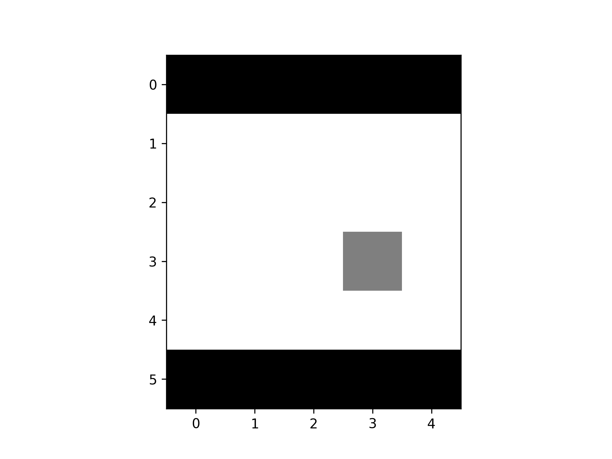

<p align="center">

  <h1 align="center">PyTorch implementation of Combined Reinforcement Learning via Abstract Representations</h1>
  <p align="center">
    <a href="https://twitter.com/khanhvu207"><strong>Khanh Vu</strong></a>
  </p>
  <p align="center"><strong>Vrije Universiteit Amsterdam</strong></p>
  <div align="center"></div>
</p>
<br>

<div align="center">
    <div class="image-container">
        
        
        
    </div>
</div>

## Introduction
During my Bachelor's years 2021-2022, I was fortunated to work with Prof. Dr. Vincent François-Lavet on a reinforcement learning project with a focus on representation learning.
This repository features my PyTorch implementation of his paper [Combined Reinforcement Learning via Abstract Representations](https://arxiv.org/abs/1809.04506).
The core algorithm consists of a contrastive representation learning module for the unsupervised learning of world models and a model-free Q-learning for decision making and planning.
In the project, I worked on the world models learning part specifically.

## Installation
1. Create a virtual environment
```
python3 -m venv venv
source venv/bin/activate
```

2. Install dependencies
```
pip3 install -r requirements.txt
```

## Run the model
1. Modify the `config.yaml` file to change the learning environment and hyperparameters of the model.
```yaml
experiment_args:
  steps_per_epoch: 5000
  epochs: 10
  steps_per_test: 5000

env_args:
  env_name: "loop_maze_full"
  size_x: 5
  size_y: 5
  higher_dim_obs: False

train_args:
  internal_dim: 2
  update_rule: 'rmsprop'
  learning_rate: 0.0005
  learning_rate_decay: 0.5
  rms_decay: 0.9
  rms_epsilon: 0.0001
  momentum: 0
  clip_norm: 1.0
  beta2: 0.1
  C: 2
  radius: 1.0
  epsilon_start: 1.0
  epsilon_min: 1.0
  epsilon_decay: 10000
  update_frequency: 1
  replay_memory_size: 1000000
  batch_size: 32
  freeze_interval: 1000
  deterministic: True
  discount: 0.9
  discount_inc: 1
  discount_max: 0.99
  device: 'cpu'

logger_args:
  online_mode: False
```
2. Run the model via
```
python3 main.py
```
